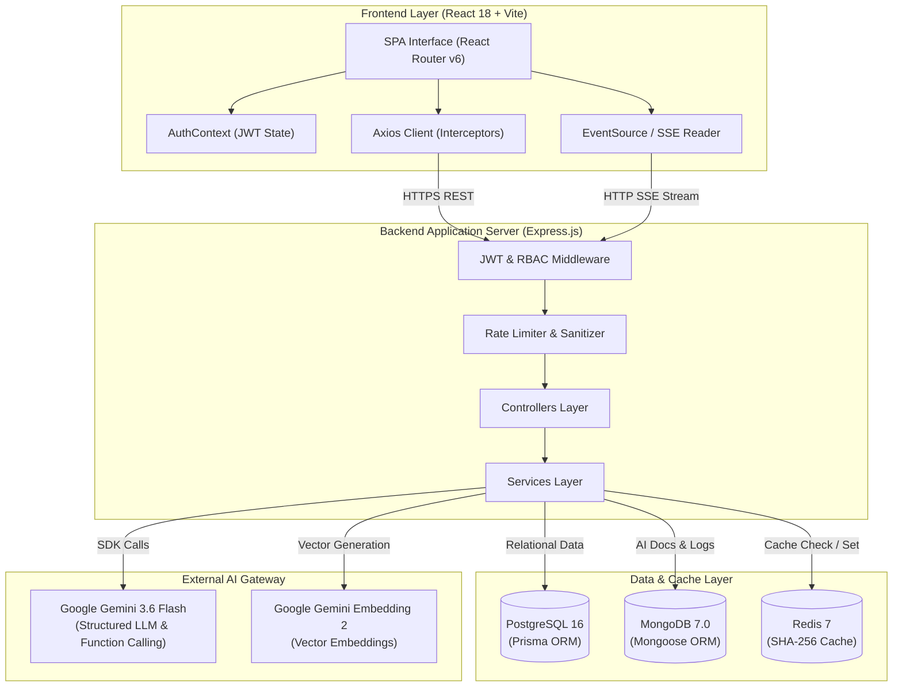
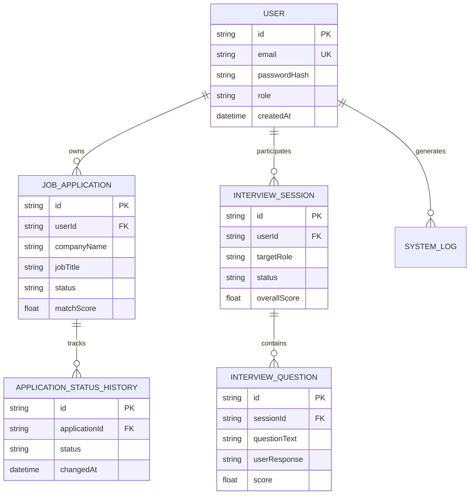
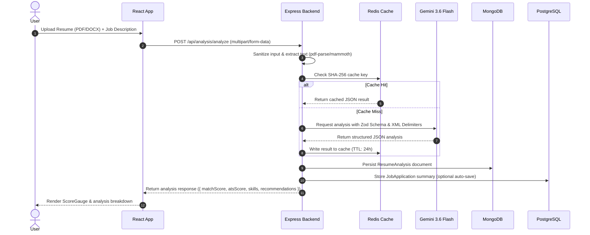
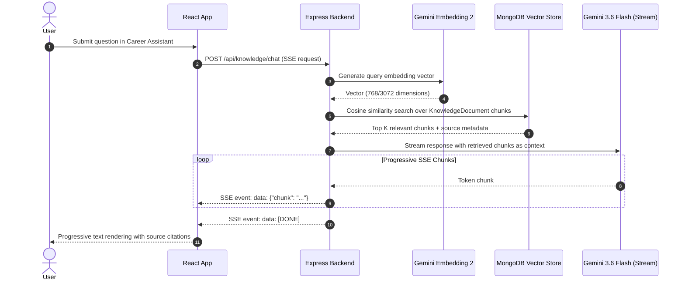
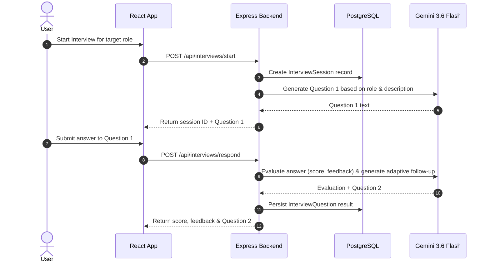

# ResumeMatch AI — High-Level Design (HLD) Document

## 1. Executive Summary & Project Overview

**ResumeMatch AI** is a production-grade, full-stack AI career intelligence platform designed to bridge the gap between job seekers' resumes and target job descriptions. The platform provides automated ATS (Applicant Tracking System) compatibility scoring, missing skill gap analysis, personalized recommendations, an embedding-based RAG career assistant, interactive multi-step mock interview practice, and real-time job application tracking.

### Problem Statement
Modern hiring processes rely heavily on automated ATS filters. Job seekers frequently submit resumes that miss critical target keywords, lack role alignment, or fail ATS structural parsing. Furthermore, candidates lack immediate feedback on skill deficits or personalized practice for technical and behavioral interview questions tailored to specific job postings.

### Solution Overview
ResumeMatch AI leverages Google Gemini 3.6 Flash LLM for structured resume parsing and compatibility evaluation, Gemini Embedding 2 for semantic Retrieval-Augmented Generation (RAG) over career knowledge documents, and an adaptive multi-step AI interview agent. The system is backed by a dual-database architecture (PostgreSQL for relational transactional data and MongoDB for flexible AI document storage) alongside Redis caching for low-latency response delivery.

---

## 2. System Architecture & High-Level Topology



---

## 3. Technology Stack & Architectural Decisions

| Layer | Technology | Justification & Architectural Role |
|---|---|---|
| **Frontend UI** | React 18, Vite | Component-based single-page application with hot module replacement and fast production bundling. |
| **Frontend Styling** | Vanilla CSS Design System | Custom CSS tokens, glassmorphism, responsive grid/flexbox layouts, and Lucide icons without external framework overhead. |
| **Backend Runtime** | Node.js (v20+), Express.js | Event-driven, asynchronous I/O handling high concurrency, streaming responses, and RESTful routing with ES Modules (`"type": "module"`). |
| **Relational DB** | PostgreSQL 16, Prisma ORM | Strongly typed, ACID-compliant database for structured relational entities (Users, Applications, Interview Sessions, Status History). |
| **Document DB** | MongoDB 7.0, Mongoose | Schema-flexible document database for nested AI evaluation outputs, RAG conversation histories, token logs, and analytics. |
| **Cache Layer** | Redis 7 (`ioredis`) | High-speed key-value store caching deterministic resume analysis outputs (SHA-256 key hashing) with 24-hour TTL and fail-open resilience. |
| **Generative AI** | `@google/genai` SDK (`gemini-3.6-flash`) | Fast, cost-efficient LLM for structured JSON output generation, prompt sanitization, tool calling, and multi-turn interview interactions. |
| **Embeddings & RAG**| Google Gemini Embedding 2 (`gemini-embedding-2`) | Generates semantic vector embeddings for knowledge retrieval over custom career markdown documents. |
| **Authentication** | JWT (`jsonwebtoken`), `bcryptjs` | Stateless Bearer token authentication with 12-round bcrypt password hashing and Role-Based Access Control (`USER` / `ADMIN`). |
| **Containerization** | Docker, Docker Compose, Nginx | Multi-stage Docker builds orchestrating all microservices in development (`docker-compose.dev.yml`) and production (`docker-compose.yml`). |

---

## 4. Architectural Subsystems

### 4.1 Frontend Architecture
The frontend is constructed as a React 18 Single-Page Application (SPA) bundled via Vite:
* **Routing**: Managed by `react-router-dom` (v6) with `ProtectedRoute` wrappers validating user authentication and role claims (`USER` vs `ADMIN`).
* **State Management**: Global user session state maintained in `AuthContext`, handling token persistence in `localStorage` and automatic header injection via Axios request interceptors.
* **Component Design**: Modular, reusable UI components (`Navbar`, `ScoreGauge`, `SkillBadge`, `DashboardCard`, `FileUploader`, `LoadingSpinner`, `StreamingText`, `ErrorMessage`, `ConfirmDialog`).
* **Streaming Reader**: Custom EventSource / fetch stream consumer in `CareerAssistant` displaying token-by-token SSE responses from Gemini.

### 4.2 Backend Layered Architecture
The Express backend follows a strict Controller-Service-Repository pattern:
```text
Routes -> Middleware -> Controllers -> Services -> Data Access / External APIs -> Standardized JSON Response
```
* **Middleware Layer**: Enforces authentication (`auth.js`), RBAC (`roleAuth.js`), input validation (`validate.js`), rate limiting (`rateLimiter.js`), file uploads (`upload.js`), and centralized error handling (`errorHandler.js`).
* **Controller Layer**: Decouples HTTP request/response handling from business logic, returning consistent payload formats: `{ success: true, data: ... }` or `{ success: false, error: { message, code } }`.
* **Service Layer**: Encapsulates core application logic including Gemini LLM integration, vector semantic search, cache orchestration, document parsing, and database transactions.

### 4.3 Database Architecture & Dual-DB Rationale



* **PostgreSQL + Prisma ORM**: Dedicated to core transactional data.
  * **Transactions**: Used for atomic multi-table writes (e.g., creating a `JobApplication` alongside its initial `ApplicationStatusHistory` record within a single Prisma transaction `$transaction`).
* **MongoDB + Mongoose**: Dedicated to unstructured/semi-structured AI outputs.
  * **Collections**: `ResumeAnalysis` (nested skills, strengths, ATS breakdowns), `AIConversation` (RAG chat histories), `LLMResponse` (token/latency monitoring logs), `EvaluationResult` (LLM benchmark scores), `KnowledgeDocument` (vector chunks).
  * **Aggregation Pipelines**: Utilized in `analyticsService.js` using `$match`, `$group`, `$unwind`, `$sort`, `$project` to calculate platform metrics in real time.

### 4.4 Caching Architecture (Redis)
* **Strategy**: Deterministic prompt response caching.
* **Key Format**: `analysis:${sha256(normalizedResumeText + normalizedJobDescription)}`
* **TTL**: 86,400 seconds (24 hours).
* **Fail-Open Resilience**: If Redis goes offline, `cacheService.js` logs a non-blocking error and bypasses cache lookup, directing requests directly to Gemini without disrupting service.

### 4.5 External AI Architecture (Google Gemini Integration)
* **Model Selection**: `gemini-3.6-flash` for high speed, cost efficiency, and native support for structured JSON generation via Zod schemas.
* **Embedding Model**: `gemini-embedding-2` producing semantic vector representations for similarity search against indexed knowledge chunks.
* **Structured Output Enforcement**: Prompts mandate JSON output adhering to Zod schemas (`analysisSchema`, `interviewEvalSchema`).
* **Function Calling**: Gemini tool definitions allow the model to invoke backend-controlled functions (`calculateSkillGap`, `getUserApplications`, `getResumeAnalysis`, `saveInterviewResult`) without exposing raw database handles to the LLM.

### 4.6 Security & Prompt Injection Defense
* **Defense-in-Depth Sanitization**: `sanitizer.js` inspects user inputs before prompt construction, stripping known injection signatures (`ignore previous instructions`, `system:`, `reveal prompt`).
* **Delimited Prompts**: User inputs are strictly wrapped in XML/Markdown boundaries (e.g., `<resume_text>`, `<job_description>`) within system instructions.
* **RBAC**: Protected routes enforce strict role checks (Standard `USER` vs System `ADMIN`), rejecting unauthorized calls with HTTP `403 Forbidden`.

---

## 5. End-to-End Core Data Flows

### 5.1 Resume Analysis Flow



### 5.2 RAG Career Assistant SSE Streaming Flow



### 5.3 AI Mock Interview Flow



---

## 6. Containerization & Deployment Architecture

```mermaid
flowchart LR
    subgraph Docker_Host ["Docker Compose Host"]
        NGINX["Nginx Container\n(Port 3000 / Port 80)"]
        FE_APP["Frontend Node/Vite Container"]
        BE_APP["Backend Node Express Container\n(Port 5000)"]
        PG_CONT["PostgreSQL Container\n(Port 5432)"]
        MONGO_CONT["MongoDB Container\n(Port 27017)"]
        REDIS_CONT["Redis Container\n(Port 6379)"]
    end

    Client Browser -->|HTTP:3000| NGINX
    NGINX -->|Static Files| FE_APP
    NGINX -->|/api Reverse Proxy| BE_APP
    BE_APP --> PG_CONT
    BE_APP --> MONGO_CONT
    BE_APP --> REDIS_CONT
```

* **Development Environment**: Orchestrated via `docker-compose.dev.yml` running PostgreSQL, MongoDB, and Redis containers with persistent local volumes (`pgdata`, `mongo_data`, `redis_data`).
* **Production Deployment**: Defined in `docker-compose.yml` including containerized Frontend (serving static distribution via Nginx), containerized Express Backend, and healthchecked database services connected over an isolated Docker network (`ai_resume_default`).
