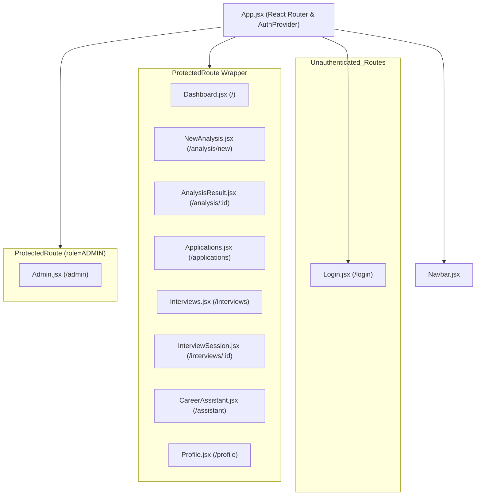

# ResumeMatch AI — Low-Level Design (LLD) Document

## 1. Directory & Module Structure

```text
C:\Users\Joel Joy\OneDrive\Desktop\Pro_Score\AI_resume
├── docker-compose.dev.yml
├── docker-compose.yml
├── README.md
├── HLD.md
├── LLD.md
├── PRD.md
├── ARCHITECTURE.md
├── API.md
├── SECURITY.md
├── EVALUATION.md
├── VIVA_GUIDE.md
├── RUBRIC_MAPPING.md
├── QA_REPORT.md
├── FINAL_STATUS.md
├── VIVA_CHEAT_SHEET.md
├── backend/
│   ├── .env
│   ├── .env.example
│   ├── Dockerfile
│   ├── package.json
│   ├── jest.config.js
│   ├── evaluation/
│   │   ├── runEvaluation.js
│   │   └── testCases.json
│   ├── knowledge/
│   │   ├── ats-guidelines.md
│   │   ├── career-advice.md
│   │   ├── interview-prep.md
│   │   └── resume-writing.md
│   ├── prisma/
│   │   ├── schema.prisma
│   │   └── seed.js
│   ├── scratch/
│   │   ├── test_gemini_connection.js
│   │   ├── test_gemini_embeddings.js
│   │   ├── test_gemini_interview.js
│   │   ├── test_gemini_streaming.js
│   │   ├── test_gemini_structured.js
│   │   └── test_gemini_tools.js
│   ├── tests/
│   │   ├── auth.test.js
│   │   └── security.test.js
│   └── src/
│       ├── app.js
│       ├── server.js
│       ├── config/
│       │   ├── env.js
│       │   ├── gemini.js
│       │   ├── mongo.js
│       │   ├── prisma.js
│       │   └── redis.js
│       ├── controllers/
│       │   ├── adminController.js
│       │   ├── analysisController.js
│       │   ├── applicationController.js
│       │   ├── authController.js
│       │   ├── interviewController.js
│       │   └── knowledgeController.js
│       ├── jobs/
│       │   └── cronJobs.js
│       ├── middleware/
│       │   ├── auth.js
│       │   ├── errorHandler.js
│       │   ├── rateLimiter.js
│       │   ├── roleAuth.js
│       │   ├── upload.js
│       │   └── validate.js
│       ├── models/
│       │   ├── AIConversation.js
│       │   ├── EvaluationResult.js
│       │   ├── KnowledgeDocument.js
│       │   ├── LLMResponse.js
│       │   └── ResumeAnalysis.js
│       ├── prompts/
│       │   ├── analysisPrompt.js
│       │   ├── interviewPrompt.js
│       │   ├── ragPrompt.js
│       │   └── schemas.js
│       ├── routes/
│       │   ├── admin.js
│       │   ├── analysis.js
│       │   ├── applications.js
│       │   ├── auth.js
│       │   ├── interviews.js
│       │   └── knowledge.js
│       ├── services/
│       │   ├── analyticsService.js
│       │   ├── cacheService.js
│       │   ├── embeddingService.js
│       │   ├── interviewService.js
│       │   ├── llmService.js
│       │   ├── parserService.js
│       │   ├── ragService.js
│       │   ├── sanitizer.js
│       │   └── toolService.js
│       └── utils/
│           ├── errors.js
│           ├── hashes.js
│           ├── response.js
│           └── validators.js
└── frontend/
    ├── package.json
    ├── vite.config.js
    ├── index.html
    └── src/
        ├── App.jsx
        ├── index.css
        ├── main.jsx
        ├── components/
        │   ├── ConfirmDialog.jsx
        │   ├── DashboardCard.jsx
        │   ├── EmptyState.jsx
        │   ├── ErrorMessage.jsx
        │   ├── FileUploader.jsx
        │   ├── LoadingSpinner.jsx
        │   ├── Navbar.jsx
        │   ├── ProtectedRoute.jsx
        │   ├── ScoreGauge.jsx
        │   ├── SkillBadge.jsx
        │   └── StreamingText.jsx
        ├── context/
        │   └── AuthContext.jsx
        ├── pages/
        │   ├── Admin.jsx
        │   ├── AnalysisResult.jsx
        │   ├── Applications.jsx
        │   ├── CareerAssistant.jsx
        │   ├── Dashboard.jsx
        │   ├── InterviewSession.jsx
        │   ├── Interviews.jsx
        │   ├── Login.jsx
        │   ├── NewAnalysis.jsx
        │   └── Profile.jsx
        └── services/
            └── api.js
```

---

## 2. Backend Module Specifications

### 2.1 Configuration Layer (`backend/src/config/`)
* **`env.js`**: Validates required environment variables on startup (`GEMINI_API_KEY`, `DATABASE_URL`, `MONGODB_URI`, `REDIS_URL`, `JWT_SECRET`) and exports sanitized settings.
* **`gemini.js`**: Instantiates the official `@google/genai` GoogleGenAI client initialized with process `GEMINI_API_KEY`. Exports `aiClient` instance.
* **`prisma.js`**: Initializes Prisma Client (`@prisma/client`) singleton with logging configuration.
* **`mongo.js`**: Establishes connection to MongoDB via Mongoose (`mongoose.connect`). Handles connection retries and error logging.
* **`redis.js`**: Configures `ioredis` connection to Redis host. Implements connection error listeners to support fail-open caching.

### 2.2 Controllers (`backend/src/controllers/`)
* **`authController.js`**:
  * `signup(req, res, next)`: Validates registration payload, hashes password with `bcryptjs` (12 rounds), creates `User` in PostgreSQL via Prisma, generates JWT token (`jwt.sign`), and returns user payload.
  * `login(req, res, next)`: Authenticates user credentials, compares bcrypt hash (`bcrypt.compare`), issues JWT, and updates system log.
  * `getMe(req, res, next)`: Retrieves active user profile from PostgreSQL excluding password hash.
* **`analysisController.js`**:
  * `analyzeResume(req, res, next)`: Handles file upload (`req.file`), calls `parserService.js` to extract text, runs input through `sanitizer.js`, checks `cacheService.js` for SHA-256 hash hit, invokes `llmService.js` for Gemini structured evaluation, saves document in MongoDB (`ResumeAnalysis`), and returns analysis payload.
  * `getHistory(req, res, next)`: Fetches past resume analyses for the authenticated user from MongoDB sorted by creation timestamp descending.
  * `getAnalysisById(req, res, next)`: Retrieves specific analysis record by ID after verifying ownership.
* **`applicationController.js`**:
  * `createApplication(req, res, next)`: Creates job application record in PostgreSQL using Prisma Transaction (`$transaction`) to atomically insert `JobApplication` and initial `ApplicationStatusHistory` record (`APPLIED`).
  * `getApplications(req, res, next)`: Lists user job applications with filtering, sorting, and pagination.
  * `updateStatus(req, res, next)`: Updates application status within a Prisma transaction, recording old status, new status, and timestamp in history table.
  * `deleteApplication(req, res, next)`: Removes application record after ownership authorization.
* **`interviewController.js`**:
  * `startInterview(req, res, next)`: Creates `InterviewSession` in PostgreSQL and MongoDB, invokes `interviewService.js` to generate Question 1 via Gemini, and returns session ID + question.
  * `submitResponse(req, res, next)`: Takes candidate answer, scores performance using Gemini, persists `InterviewQuestion` in PostgreSQL, updates overall score, and generates dynamic follow-up question.
  * `completeInterview(req, res, next)`: Finalizes session, generates summary feedback report, and updates status to `COMPLETED`.
* **`knowledgeController.js`**:
  * `chatStream(req, res, next)`: Handles RAG questions. Invokes `ragService.js` to search MongoDB vector store using query embedding from Gemini Embedding 2, sets SSE headers (`text/event-stream`), streams response tokens to frontend, and appends source citations.
* **`adminController.js`**:
  * `getPlatformAnalytics(req, res, next)`: Enforces `ADMIN` role access, runs MongoDB Aggregation Pipelines in `analyticsService.js`, and computes total users, application counts, token usage, latency metrics, and top missing skills across all platform analyses.

### 2.3 Services Layer (`backend/src/services/`)
* **`llmService.js`**: Wraps `@google/genai` calls. Sets `responseSchema` for structured JSON output adhering to Zod schemas. Handles automated 1-step retry if JSON formatting fails.
* **`embeddingService.js`**: Calls Gemini Embedding 2 (`gemini-embedding-2`) to generate 768-dimensional or 3072-dimensional vector arrays for text inputs.
* **`ragService.js`**: Manages document chunking (~500 chars), stores vectors in MongoDB `KnowledgeDocument` collection, performs cosine similarity search between query vector and document chunks, and injects top-K chunks into system context.
* **`toolService.js`**: Defines function declarations (`calculateSkillGap`, `getUserApplications`, `getResumeAnalysis`, `saveInterviewResult`). Implements secure execution handlers that execute DB reads/writes on behalf of authorized LLM tool calls.
* **`interviewService.js`**: Encapsulates adaptive mock interview state logic, scoring algorithms, and dynamic follow-up generation.
* **`cacheService.js`**: Hashes input parameters (`SHA-256(resumeText + jobDescription)`), reads/writes Redis strings with 24-hour TTL, and provides fail-open exception handling.
* **`parserService.js`**: Extracts plain text from uploaded PDF (`pdf-parse`) and DOCX (`mammoth`) buffers with temporary file cleanup.
* **`sanitizer.js`**: Implements regex rules detecting prompt injection patterns (`ignore previous instructions`, `system:`, `reveal system prompt`), returning clean sanitized strings or throwing validation errors.
* **`analyticsService.js`**: Executes MongoDB aggregation pipelines (`$match`, `$group`, `$unwind`, `$sort`, `$project`) aggregating usage, latency, and skill statistics.

---

## 3. Database Models & Schema Specifications

### 3.1 Relational Schema (PostgreSQL + Prisma)

```prisma
datasource db {
  provider = "postgresql"
  url      = env("DATABASE_URL")
}

generator client {
  provider = "prisma-client-js"
}

enum Role {
  USER
  ADMIN
}

enum ApplicationStatus {
  APPLIED
  INTERVIEWING
  OFFER
  REJECTED
  ARCHIVED
}

model User {
  id            String           @id @default(uuid())
  email         String           @unique
  passwordHash  String
  name          String?
  role          Role             @default(USER)
  createdAt     DateTime         @default(now())
  updatedAt     DateTime         @updatedAt
  applications  JobApplication[]
  interviews    InterviewSession[]
  logs          SystemLog[]

  @@map("users")
}

model JobApplication {
  id             String                     @id @default(uuid())
  userId         String
  user           User                       @relation(fields: [userId], references: [id], onDelete: Cascade)
  companyName    String
  jobTitle       String
  jobDescription String?                    @db.Text
  status         ApplicationStatus          @default(APPLIED)
  matchScore     Float?
  appliedDate    DateTime                   @default(now())
  updatedAt      DateTime                   @updatedAt
  statusHistory  ApplicationStatusHistory[]

  @@map("job_applications")
}

model ApplicationStatusHistory {
  id            String         @id @default(uuid())
  applicationId String
  application   JobApplication @relation(fields: [applicationId], references: [id], onDelete: Cascade)
  status        ApplicationStatus
  changedAt     DateTime       @default(now())

  @@map("application_status_history")
}

model InterviewSession {
  id           String              @id @default(uuid())
  userId       String
  user         User                @relation(fields: [userId], references: [id], onDelete: Cascade)
  targetRole   String
  status       String              @default("IN_PROGRESS")
  overallScore Float?
  createdAt    DateTime            @default(now())
  questions    InterviewQuestion[]

  @@map("interview_sessions")
}

model InterviewQuestion {
  id           String           @id @default(uuid())
  sessionId    String
  session      InterviewSession @relation(fields: [sessionId], references: [id], onDelete: Cascade)
  questionText String
  userResponse String?          @db.Text
  feedback     String?          @db.Text
  score        Float?
  createdAt    DateTime         @default(now())

  @@map("interview_questions")
}

model SystemLog {
  id        String   @id @default(uuid())
  userId    String?
  user      User?    @relation(fields: [userId], references: [id], onDelete: SetNull)
  action    String
  details   String?
  createdAt DateTime @default(now())

  @@map("system_logs")
}
```

### 3.2 MongoDB Collections (Mongoose Models)

* **`ResumeAnalysis`**:
  ```javascript
  const ResumeAnalysisSchema = new Schema({
    userId: { type: String, required: true, index: true },
    resumeTextHash: { type: String, required: true, index: true },
    matchScore: { type: Number, required: true },
    atsScore: { type: Number, required: true },
    summary: { type: String },
    matchedSkills: [{ type: String }],
    missingSkills: [{ type: String }],
    recommendations: [{ type: String }],
    rawLLMOutput: { type: Object },
    createdAt: { type: Date, default: Date.now }
  });
  ```
* **`KnowledgeDocument` (Vector Store)**:
  ```javascript
  const KnowledgeDocumentSchema = new Schema({
    title: { type: String, required: true },
    category: { type: String, required: true },
    contentChunk: { type: String, required: true },
    embedding: { type: [Number], required: true }, // Vector array (gemini-embedding-2)
    chunkIndex: { type: Number }
  });
  ```
* **`LLMResponse` (Token Analytics)**:
  ```javascript
  const LLMResponseSchema = new Schema({
    userId: { type: String, index: true },
    model: { type: String, required: true },
    promptTokens: { type: Number },
    completionTokens: { type: Number },
    totalTokens: { type: Number },
    latencyMs: { type: Number },
    endpoint: { type: String },
    createdAt: { type: Date, default: Date.now }
  });
  ```

---

## 4. Frontend Component & Router Architecture



### Component Details
* **`AuthContext.jsx`**: Provides `user`, `token`, `login()`, `logout()` global actions. Intercepts HTTP `401 Unauthorized` responses to clear invalid sessions.
* **`api.js`**: Configures Axios instance (`baseURL: '/api'`). Injects `Authorization: Bearer <token>` header into every outgoing HTTP request.
* **`ScoreGauge.jsx`**: Visual circular radial score indicator rendering match and ATS scores dynamically with HSL color scaling (Red $\rightarrow$ Amber $\rightarrow$ Green).
* **`StreamingText.jsx`**: Smooth progressive text typewriter effect for SSE chunks delivered by Gemini.
* **`FileUploader.jsx`**: Drag-and-drop file upload component validating file extensions (.pdf, .docx) and file size bounds (< 5MB).

---

## 5. Security, Validation & Error Handling Patterns

### 5.1 Zod Schema Validation (`prompts/schemas.js`)
All structured LLM outputs are validated against strict Zod runtime schemas:
```javascript
export const analysisSchema = z.object({
  matchScore: z.number().min(0).max(100),
  atsScore: z.number().min(0).max(100),
  summary: z.string(),
  matchedSkills: z.array(z.string()),
  missingSkills: z.array(z.string()),
  recommendations: z.array(z.string())
});
```

### 5.2 Centralized Error Handling (`middleware/errorHandler.js`)
Custom application error class `AppError` maps standard operational failures to HTTP status codes:
```javascript
export class AppError extends Error {
  constructor(message, statusCode, code = 'INTERNAL_ERROR') {
    super(message);
    this.statusCode = statusCode;
    this.code = code;
  }
}
```
All errors pass through `errorHandler.js`, producing uniform client responses:
```json
{
  "success": false,
  "error": {
    "message": "Resource not found",
    "code": "NOT_FOUND"
  }
}
```
| Error Code | HTTP Status | Trigger Condition |
|---|---|---|
| `VALIDATION_ERROR` | `400` | Invalid request payload or failed Zod parse |
| `UNAUTHORIZED` | `401` | Missing or expired JWT token |
| `FORBIDDEN` | `403` | Insufficient RBAC role rights |
| `NOT_FOUND` | `404` | Database entity does not exist |
| `CONFLICT` | `409` | Duplicate user registration email |
| `RATE_LIMITED` | `429` | Exceeded Express rate limit threshold |
| `INTERNAL_ERROR` | `500` | Unhandled server exception |
